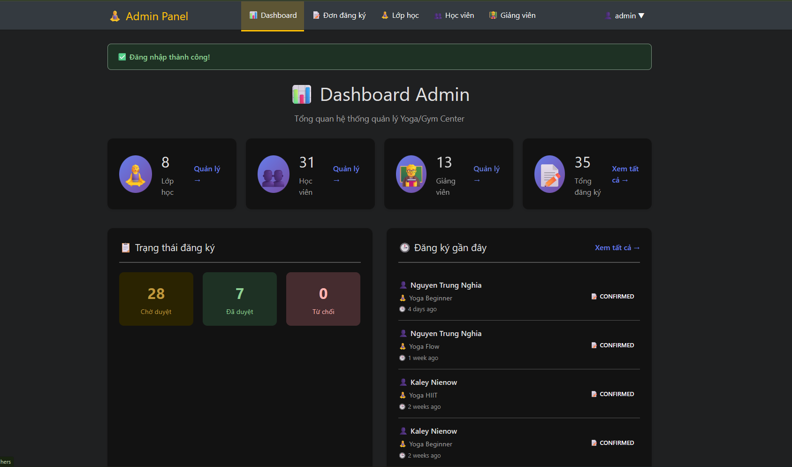
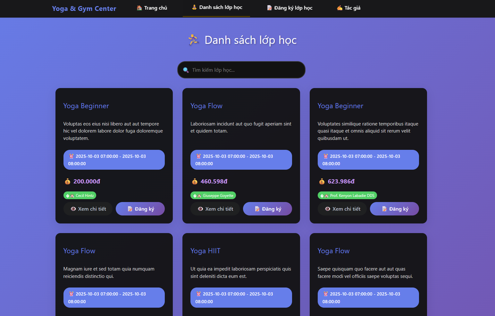
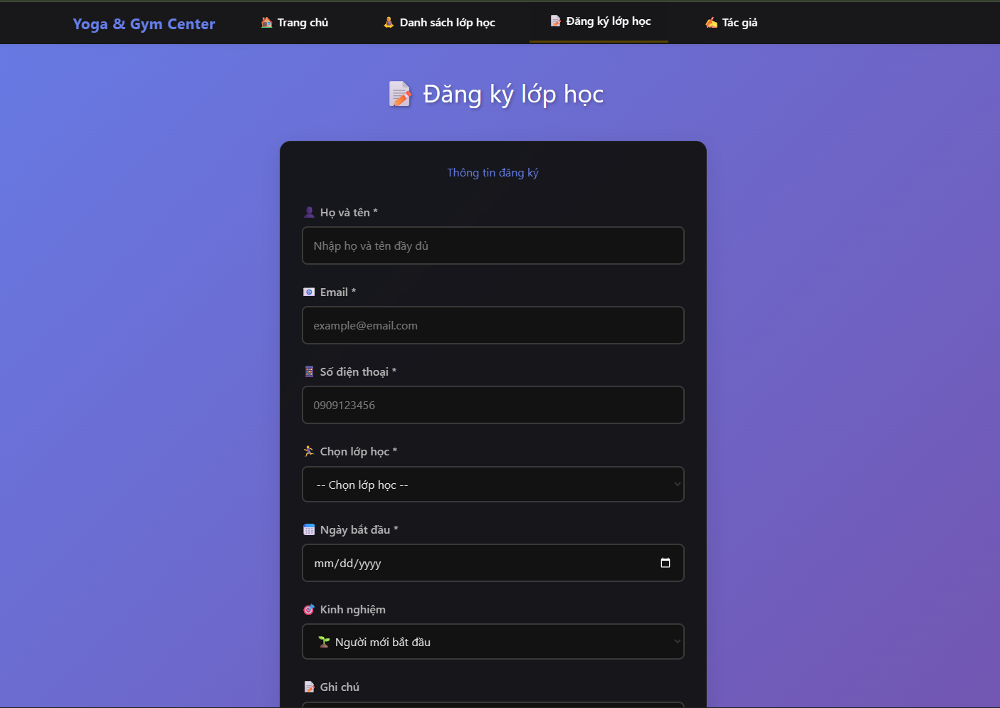

# 🧘‍♀️ Yoga/Gym Center Management System

<p align="center">
	
	
	
</p>

## 🌍 Language Selection / 言語選択


<details>
<summary>📖 日本語</summary>

**ヨガ・ジム管理システム（シンプル＆直感的）**

### 🚩 主な機能
- 生徒登録・承認フロー
- クラス・講師・会員管理
- 管理者ダッシュボード・統計
- レスポンシブUI（Bootstrap, Tailwind）
- RESTful API連携

### 🛠️ 技術スタック
- Laravel 12 (PHP 8.2+)
- MySQL 8+
- Blade, Bootstrap 5, Tailwind CSS
- Vite, バニラJS
- Composer, NPM

### 📁 プロジェクト構成（主なフォルダ）
- `app/` — コアロジック（コントローラ・モデル等）
- `resources/views/` — Bladeテンプレート（UI）
- `routes/` — ルート定義
- `public/` — エントリーポイント・アセット
- `database/` — マイグレーション・シーダー・ファクトリ
- `config/` — 設定ファイル

### 🚀 クイックスタート
1. `git clone ... && cd Yoga-Website-PHP`
2. `composer install && npm install && npm run build`
3. `.env`とDBを設定
4. `php artisan migrate --seed && php artisan serve`

[http://localhost:8000](http://localhost:8000) にアクセス

### 🔑 管理者アカウント
```
ユーザー名: admin
パスワード: 123456
```

### 📚 API例
- `GET /api/public/classes` — クラス一覧取得
- `POST /api/registrations` — クラス登録

### 👤 作者
Nguyễn Trung Nghĩa  
[GitHub](https://github.com/nguyentrungnghia1802) | [個人ページ](https://nguyentrungnghia1802.github.io/Profile/)

</details>


<details>
<summary>📖 English</summary>

**A modern, easy-to-use management system for yoga/gym centers.**

### 🚩 Key Features
- Student registration & approval workflow
- Class, teacher, and member management
- Admin dashboard & statistics
- Responsive UI (Bootstrap, Tailwind)
- RESTful API for integration

### 🛠️ Technology Stack
- Laravel 12 (PHP 8.2+)
- MySQL 8+
- Blade, Bootstrap 5, Tailwind CSS
- Vite, Vanilla JS
- Composer, NPM

### 📁 Project Structure (Main Folders)
- `app/` — Core logic (Controllers, Models, ...)
- `resources/views/` — Blade templates (UI)
- `routes/` — Route definitions
- `public/` — Entry point, assets
- `database/` — Migrations, seeders, factories
- `config/` — Configuration files

### 🚀 Quick Start
1. `git clone ... && cd Yoga-Website-PHP`
2. `composer install && npm install && npm run build`
3. Setup `.env` and database
4. `php artisan migrate --seed && php artisan serve`

Visit: [http://localhost:8000](http://localhost:8000)

### 🔑 Default Admin
```
Username: admin
Password: 123456
```

### 📚 API Example
- `GET /api/public/classes` — List classes
- `POST /api/registrations` — Register for class

### 👤 Author
Nguyễn Trung Nghĩa  
[GitHub](https://github.com/nguyentrungnghia1802) | [Profile](https://nguyentrungnghia1802.github.io/Profile/)

</details>

